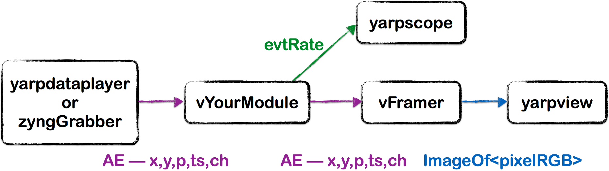
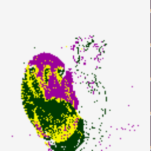
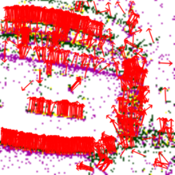

# Tutorial on Handling the Event Driven Data Stream
This tutorial introduces the basic components for handling event-driven data stream. You will use a simple application to learn the dedicated data structures and functions in the event-driven library and the basic components required to create an event-driven module.

# Requirements:
Your current set-up comprises YARP, iCub (some of the event-driven modules require iCub) and iCubContrib (for easy install of the executables). In addition you need the **robotology-playground/event-driven**(https://github.com/robotology-playground/event-driven.git) library.

### Note: 
The event-driven code is already installed in your virtual machine (alternatively, you should have followed the installing instructions in the vvv [wiki](https://github.com/vvv-school/vvv-school.github.io/blob/master/instructions/how-to-prepare-your-system.md#install-event-driven)), however, as there have been few updates, you need to follow [these instrucitons](https://github.com/vvv-school/vvv17/issues/39). 

# The event-driven library

The event-driven library allows you to use datastructures and helper modules to handle events. To include the libraries and use the namespace:

```javascript
#include "iCub/eventdriven/all.h"
using namespace ev;
``` 

In this tutorial you will learn:

- Datastructures
  - vEvent
  - vBottle
  - vQueue

- Modules
  - vFramer

Some other useful (but not all covered today) modules are:
- some "smarter" event storage structures
- camera un-distortion, 
- salt and pepper filter, 
- robot interfaces, 
- circle detection, 
- cluster tracking,
- corner detection,
- ...

### Events in event-driven libraries:

We actually use several different types of events in out library and therefore we define a base class of event, the vEvent:

```javascript
class vEvent
{

protected:
    unsigned int stamp;

public:
    vEvent() : stamp(0) {}
    vEvent(const vEvent &event);
    virtual ~vEvent() {}
    
    void setStamp(const unsigned int stamp)   { this->stamp = stamp; }
    int getStamp() const                      { return stamp;        }

    virtual void encode(yarp::os::Bottle &b) const;
    virtual bool decode(const yarp::os::Bottle &packet, int &pos);

};

``` 
Therefore the vEvent simply indicates that __something__ happened at a specific time. The event cameras produce events with a sensor array address space, and the vEvent is not enough to represent this extra information. The AddressEvent is inherited from the vEvent with extra data fields: 

- ADDRESSEVENT (AE)  - adds coordinates (x, y), channel (left, right) and polarity (on, off)

In code we wrap the events using shared pointers to avoid excessive memory allocation as events are passed around a module. In many applications we don't know exactly for how long we need to keep an event and how often we might need to use it for processing; we don't have a frame for which we know we can compute all pixels together. Shared pointers simplifies the handling of memory. It also follows the allocate once principle mentioned in the first day's lecture. We reference events as:

```javascript
event<vEvent>    //can represent any type of event
event<>          //equal to event<vEvent>
event<AddressEvent> 
``` 

### event-driven and YARP

We are processing events to for humanoid vision on the iCub, therefore we use YARP! We therefore also integrate with as much of the current tools as possible.

We send events in packets using yarp Bottles, but we make a modified version (a vBottle) that inherits from a standard YARP bottle so we can:

1. can be sent over YARP ports/bufferedports without modification
1. instant compatibility with yarpdataplayer and yarpdatadumper
1. we use the flexibility and search-ability of bottles (so we can send different event types easily - we'll see more in the next tutorial)

We restrict the vBottle to only accept events inherited from the vEvent class. Under the hood, it wraps some encoding and decoding functions.

Code to use a vBottle:

```javascript
vBottle vbot;
event<> v = event<>(nullptr);
//adding events is simple
vbot.add(v);

//you can get all events, get a specific event type, ensure sorted (by timestamp)
vQueue q1 = vbot.getAll();
vQueue q2 = vbot.getSorted<AddressEvent>();
```
The vQueue is a wrapper for a `std::deque< event<> >` so we can:

```javascript
q.push_front(v); q.push_back(v);
q.pop_front(v); q.pop_back(v);
```
etc., and we can iterate through the q to access events:

```javascript
for(vQueue::iterator qi = q.front(); qi != q.end(); qi++) {

    //access events
    event<AddressEvent> = getas<AddressEvent>(*qi);
    //do some processing

}
```

You will learn these datastructures by making a tutorial application which we make like this:



Your module will 

1. read events using the callback function (OnRead), 
1. compute the event rate and display the result in **yarpscope**
1. modify the address events to correct the dataset.
1. use **vFramer** to create images and display them with **yarpview**

### Modules: vFramer

Unlike standard cameras, there are no "images" or "frames" when using events so to visualise the camera output on a synchronous display we need to create an image frame from recent events. This means that we are going to grab all of the events within a given time window (e.g. 30ms) and create a frame. The vFramer module does this for us. 

There are several command line arguments you can use in the vFramer, here is an example:

```javascript
--frameRate 30 --displays "(0 left (AE ISO) 1 right (AE ISO))" --height 240 --width 304
```
If possible vFramer will try to render frames at the given --frameRate, and the camera resolution can be set in --height and --width. The --displays argument defines how the vFramer will draw frames using the format [channel#, outportname, drawtypes] with as many tuples defined as you like. The drawtypes can also be chained such that we can draw multiple different event types layered on the same image. Order is important and some draw types are incompatible (currently FLOW ISO won't work)


###### AE
A simple view



###### ISO
A more beautiful view


###### FLOW
Visualise optical flow (we'll see this in the next tutorial)




