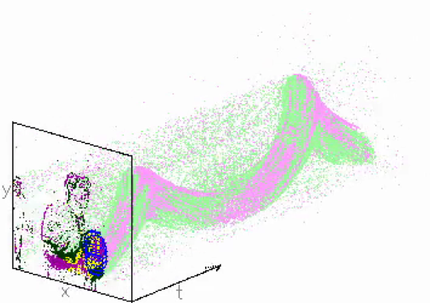

# Tutorial on Handling the Event Driven Data Stream
This tutorial introduces the basic components for handling event-driven data stream. You will use a simple application to learn the dedicated data structures and functions in the event-driven library and the basic components required to create an event-driven module.

### Requirements:
You should be familiar with the framework used by event-driven, and the required software and datasets, introduced in the [first tutorial](https://github.com/vvv-school/tutorial_event-driven-framework).

# The event-driven library

The event-driven library allows you to use datastructures and helper modules to read and write events on YARP ports, perform basic filtering, and more complex organisation. Generic access to timing information depending on the hardware is also available. To include the libraries and use the namespace:

```c++
#include "iCub/eventdriven/all.h"
using namespace ev;
``` 

In this tutorial you will learn:

- Classes
  - qAllocator
- Datastructures
  - vQueue
  - vEvent
- An understanding of the event-stream

### Events in event-driven libraries:

There are several types of events in the event-driven library (we will use just one) and therefore we define a base class of event, the vEvent:

```c++
class vEvent
{
public:
    static const std::string tag;
    unsigned int stamp:31;

    vEvent();
    virtual ~vEvent();

    virtual event<> clone();
    virtual void encode(yarp::os::Bottle &b) const;
    virtual void encode(std::vector<YARP_INT32> &b, unsigned int &pos) const;
    virtual bool decode(const yarp::os::Bottle &packet, int &pos);
    virtual yarp::os::Property getContent() const;
    virtual std::string getType() const;
    virtual int getChannel() const;
    virtual void setChannel();
};

``` 
The vEvent only contains a tag and a timestamp, which that __something__ happened at a specific time. The event cameras produce events with a sensor array address space, and the vEvent is not enough to represent this extra information. The AddressEvent is inherited from the vEvent and contains more datafields and the tag will be different: 

```c++
class AddressEvent : public vEvent
{
public:
    static const std::string tag;
    unsigned int x:10; // u position of the camera pixel
    unsigned int y:10; // v position of the camera pixel
    unsigned int channel:1; // left/right camera
    unsigned int polarity:1; //increase / decrease in light
    
 ...
```
Other events can define such things as velocity, a spatial distribution, or a point in 3D space by extending the data fields further.

When allocating events, we wrap them using shared pointers to avoid excessive memory allocation as events are passed around a module. In many applications we don't know exactly for how long we need to keep an event and how often we might need to use it for processing; we don't have a frame for which we know we can compute all pixels together. Shared pointers simplifies the handling of memory. We reference events as:

```c++
event<vEvent>    //can represent any type of event
event<>          //equal to event<vEvent>
event<AddressEvent> 
``` 

### event-driven and YARP

We are processing events to for humanoid vision on the iCub, therefore we use YARP! We therefore also integrate with as much of the current tools as possible.

We send events in packets using yarp Bottles, but we make a modified version (a vBottle) that inherits from a standard YARP bottle so we can:

1. can be sent over YARP ports/bufferedports without modification
1. instant compatibility with yarpdataplayer and yarpdatadumper
1. we use the flexibility and search-ability of bottles (so we can send different event types easily - we'll see more in the next tutorial)

We restrict the vBottle to only accept events inherited from the vEvent class. Under the hood, it wraps some encoding and decoding functions.

Code to use a vBottle:

```javascript
vBottle vbot;
event<> v = event<>(nullptr);
//adding events is simple
vbot.add(v);

//you can get all events, get a specific event type, ensure sorted (by timestamp)
vQueue q1 = vbot.getAll();
vQueue q2 = vbot.getSorted<AddressEvent>();
```
The vQueue is a wrapper for a `std::deque< event<> >` so we can:

```javascript
q.push_front(v); q.push_back(v);
q.pop_front(v); q.pop_back(v);
```
etc., and we can iterate through the q to access events:

```javascript
for(vQueue::iterator qi = q.front(); qi != q.end(); qi++) {

    //access events
    event<AddressEvent> = getas<AddressEvent>(*qi);
    //do some processing

}
```

You will learn these datastructures by making a tutorial application which we make like this:


Your module will 

1. read events using the callback function (OnRead), 
1. compute the event rate and display the result in **yarpscope**
1. modify the address events to correct the dataset.
1. use **vFramer** to create images and display them with **yarpview**


###### AE
A simple view


###### ISO
A more beautiful view



###### FLOW
Visualise optical flow (we'll see this in the next tutorial)


